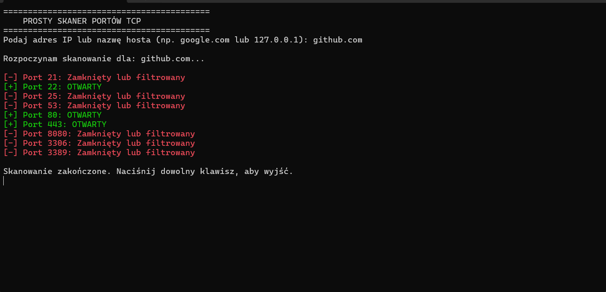

# Simple Port Scanner (C# / .NET)

Proste i skuteczne narzędzie konsolowe do diagnostyki sieciowej. Pozwala na szybką weryfikację otwartych portów TCP na wskazanym hoście.

## 📸 Demo

## 🚀 Funkcjonalności
- Skanowanie kluczowych portów (FTP, SSH, HTTP, HTTPS, RDP, SQL).
- Asynchroniczne połączenia (`async/await`) zapewniające szybkość działania.
- Timeout (1000ms) zapobiegający zawieszaniu się skanera.
- Obsługa wyjątków sieciowych (`System.Net.Sockets`).

## 🛠 Technologie
- C#
- .NET Framework / Core
- TCP/IP Sockets

## 💻 Jak uruchomić
Wymaga Visual Studio lub środowiska .NET.
1. Sklonuj repozytorium.
2. Skompiluj i uruchom plik `Program.cs`.
